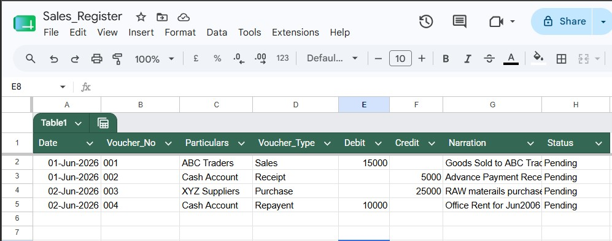
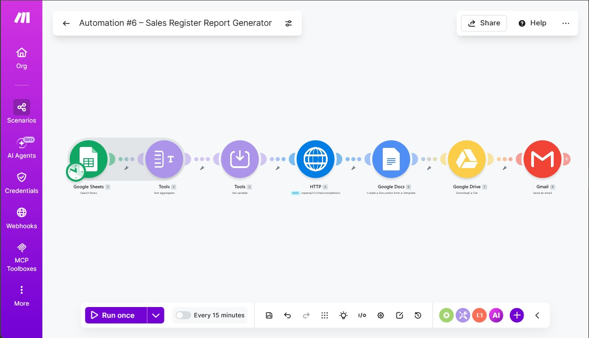
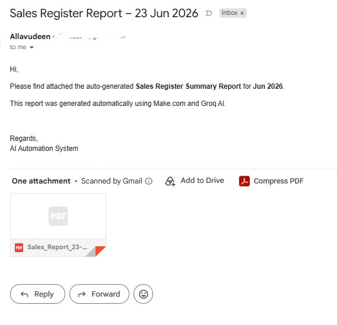
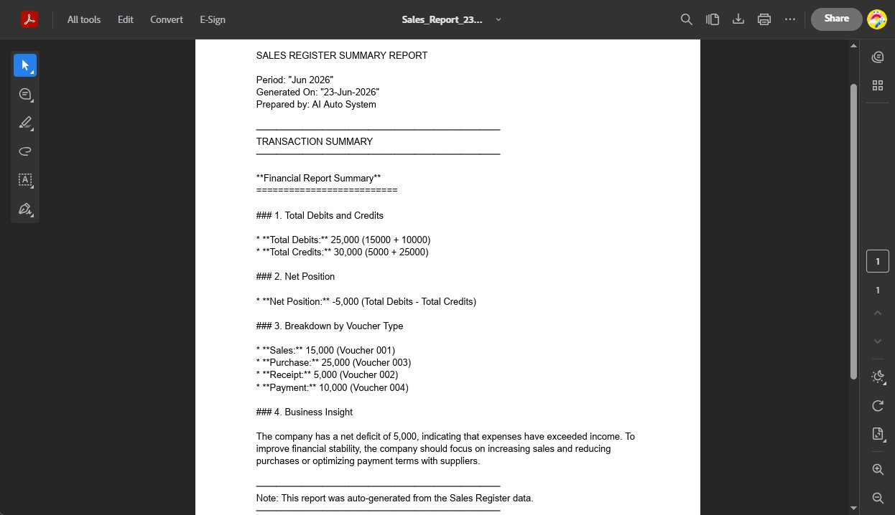

# Automation #06 – Sales Register Report Generator


---

## Overview

Automatically reads sales transaction data from Google Sheets, generates an
AI-powered financial summary using Groq LLM, creates a formatted Google Docs
report, converts it to PDF, and delivers it via Gmail — fully automated,
zero manual effort.

**Business problem solved:** Finance teams manually consolidate daily/weekly
sales register entries and write summary reports. This automation eliminates
that effort entirely — a structured PDF report lands in the inbox automatically.

---

## Workflow

```
Google Sheets (Sales Register – Status: Pending)
        ↓
Text Aggregator (format each row as pipe-delimited text)
        ↓
Set Variable (cleanText)
        ↓
HTTP – Groq API (llama-3.3-70b-versatile) → AI financial summary
        ↓
Google Docs (fill Sales_Report_Template with AI output)
        ↓
Google Drive (export filled Doc as PDF)
        ↓
Gmail (send email with PDF attachment)
```

---

## Modules

| # | Module | Action |
|---|---|---|
| 1 | Google Sheets | Search Rows (filter: Status = Pending) |
| 2 | Tools | Text Aggregator (pipe-delimited row format) |
| 3 | Tools | Set Variable (cleanText) |
| 4 | HTTP | POST → Groq API (llama-3.3-70b-versatile) |
| 6 | Google Docs | Create Document from Template |
| 7 | Google Drive | Download File (export as PDF) |
| 8 | Gmail | Send email with PDF attachment |

---

## Google Sheets Structure

| Column | Field | Example |
|---|---|---|
| A | Date | 01-Jun-2026 |
| B | Voucher_No | 001 |
| C | Particulars | ABC Traders |
| D | Voucher_Type | Sales |
| E | Debit (₹) | 15000 |
| F | Credit (₹) | — |
| G | Narration | Goods sold to ABC Traders |
| H | Status | Pending |

Auto-stamp formula in column H:
```
=IF(A2<>"","Pending","")
```

---

## Google Docs Template

Placeholders used in `Sales_Report_Template`:

| Placeholder | Value injected |
|---|---|
| `{{period}}` | Current month/year (e.g. Jun 2026) |
| `{{generated_date}}` | Run date (e.g. 23-Jun-2026) |
| `{{ai_summary}}` | Full AI-generated financial summary |

---

## Groq Prompt

```
System: You are a financial report assistant. Analyze the sales register
entries provided and produce a professional summary. Include:
1) Total Debits and Credits
2) Net position
3) Breakdown by Voucher Type (Sales/Purchase/Receipt/Payment)
4) A 2-line business insight.
Format clearly with labels.

User: {{cleanText}}
```

---

## Sample AI Output

```
Financial Report Summary
=========================

1. Total Debits and Credits
   Total Debits:  ₹25,000 (₹15,000 + ₹10,000)
   Total Credits: ₹30,000 (₹5,000 + ₹25,000)

2. Net Position
   Net Position: -₹5,000 (Total Debits - Total Credits)

3. Breakdown by Voucher Type
   Sales:    ₹15,000 (Voucher 001)
   Purchase: ₹25,000 (Voucher 003)
   Receipt:   ₹5,000 (Voucher 002)
   Payment:  ₹10,000 (Voucher 004)

4. Business Insight
   The company has a net deficit of ₹5,000, indicating expenses have
   exceeded income. Focus on increasing sales and optimising payment terms.
```

---

## Tech Stack

| Tool | Purpose |
|---|---|
| Make.com | Automation platform |
| Groq API | LLM inference (llama-3.3-70b-versatile) |
| Google Sheets | Input data source (Sales Register) |
| Google Docs | Report template engine |
| Google Drive | PDF export via MIME type conversion |
| Gmail | Report delivery with attachment |
| PDF | Final deliverable format |

---

## Key Learnings

- `toJson()` is **not available** in Make.com — use `"{{variable}}"` directly for controlled input data
- Google Drive "Download a File" module handles Docs-to-PDF conversion natively via `application/pdf` MIME type
- "Create a Document from a Template" auto-detects `{{placeholders}}` from the connected Google Doc
- Extra quotes around `formatDate()` in template placeholders cause literal quote rendering — fix by using triple quotes in Make.com formula: `"""MMM YYYY"""`
- `toJson` is an n8n function, not Make.com — important cross-platform distinction

---

## Folder Structure

```
automation-06-sales-register-report/
├── README.md
├── blueprint/
│   └── automation-06-blueprint.json
├── template/
│   └── Sales_Report_Template.txt
└── screenshots/
    ├── 01-google-sheets.png
    ├── 02-scenario-canvas.png
    ├── 03-gmail-received.png
    └── 04-pdf-output.png
```

---

## Setup Instructions

1. Copy `Sales_Register` sheet structure and add your data with Status = `Pending`
2. Create a Google Doc using the template placeholders above
3. Import `automation-06-blueprint.json` into Make.com
4. Replace all `YOUR_` placeholders with your actual connection IDs and file IDs
5. Add your Groq API key in Module 4 HTTP header
6. Run once to test — check Gmail for the PDF report

---

## Screenshots

### 01 – Google Sheets: Sales Register Input


### 02 – Make.com: Scenario Canvas


### 03 – Gmail: Report Email Received


### 04 – PDF: AI-Generated Sales Report


---

## Status

✅ Built and tested — 23 June 2026  
📁 Part of the [AI Automation Consulting Portfolio](https://github.com/Allavudeen/ai-automation-consulting)
