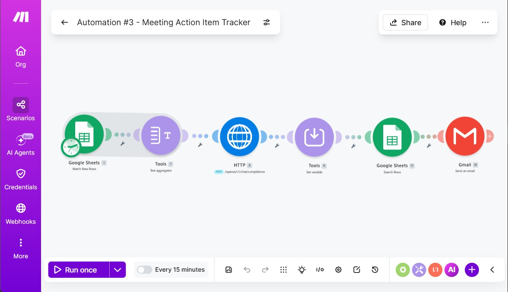

# 📝 Automation #03 — Meeting Action Item Tracker
### Automatically extract, log, and assign action items from meeting notes using AI

[](https://make.com)
[](https://groq.com)
[](https://forms.google.com)
[](https://sheets.google.com)
[](https://gmail.com)

---

## 🚨 Problem Statement

After every meeting, action items are scattered across chat messages, verbal agreements, and handwritten notes. PMs spend 20–30 minutes post-meeting extracting tasks, assigning owners, setting deadlines, and sending follow-up emails. Items frequently fall through the cracks — no one follows up, no one is accountable.

**This automation turns raw meeting notes into structured, tracked action items instantly.**

---

## ✅ Solution

After a meeting, the PM pastes raw meeting notes into a **Google Form**. The automation sends the notes to **Groq AI**, which extracts structured action items (task, owner, deadline) and logs them to **Google Sheets** and delivers an action item summary via **Gmail** to all stakeholders.

---

## 🔁 Workflow

```
Google Forms (PM submits raw meeting notes)
        ↓
Google Sheets (Store submission)
        ↓
Text Aggregator (Prepare notes for AI)
        ↓
HTTP Module → Groq API (Extract structured action items)
        ↓
Google Sheets — Get a Row (Re-expose variables)
        ↓
Google Sheets — Add Rows (Log each action item)
        ↓
Gmail (Send action item summary to stakeholders)
```

---

## 🧩 Module Breakdown

| # | Module | Purpose |
|---|---|---|
| 1 | Google Forms — Watch Responses | Trigger on new meeting note submission |
| 2 | Google Sheets — Search Rows | Retrieve the submitted notes |
| 3 | Text Aggregator | Prepare content for AI processing |
| 4 | HTTP — Groq API | Extract action items (task, owner, deadline) |
| 5 | Google Sheets — Get a Row | Re-expose mapped variables downstream |
| 6 | Google Sheets — Add Rows | Log structured action items |
| 7 | Gmail — Send Email | Deliver action item summary |

---

## 🤖 AI Prompt Used

```
You are a meeting assistant for an agile project team.

Extract all action items from the meeting notes below.
For each action item, identify:
- Task: What needs to be done
- Owner: Who is responsible
- Deadline: When it should be completed (if mentioned, else mark as TBD)

Return the output as a clean numbered list in this format:
1. Task: [task description] | Owner: [name] | Deadline: [date or TBD]

Meeting Notes:
{{cleanText}}
```

---

## 📥 Google Form Fields

| Field | Type |
|---|---|
| Meeting Name / Topic | Short answer |
| Meeting Date | Date |
| Attendees | Short answer |
| Raw Meeting Notes | Paragraph (long text) |

---

## 🗂️ Google Sheet Structure

**Input Sheet (Form Responses)**
| Column | Purpose |
|---|---|
| Timestamp | Submission time |
| Meeting Name | Topic of the meeting |
| Meeting Date | Date of meeting |
| Attendees | Who attended |
| Raw Notes | Full unstructured notes |

**Action Items Log Sheet**
| Column | Purpose |
|---|---|
| Meeting Name | Source meeting |
| Meeting Date | Date of meeting |
| Task | Extracted action item |
| Owner | Assigned person |
| Deadline | Due date or TBD |
| Status | Open / In Progress / Done |

---

## ⚙️ Technical Notes

- **Trigger:** Google Forms — Watch Responses (real-time)
- **Key Workaround:** `Google Sheets → Get a Row` added after Groq response to re-expose variables that become invisible after Text Aggregator
- **Groq Model:** `llama-3.3-70b-versatile`
- **Temperature:** 0.2 (low — precise extraction needed)
- **API Response Path:** `data → choices → [] → message → content`
- **Note** ⚠️ API keys and personal credentials have been removed from the blueprint. Replace placeholders before importing.
  
---

## 📧 Sample Output

```
Meeting Action Items — Sprint Planning | 16 Jun 2026

1. Task: Finalise API specs for payment module
   Owner: John | Deadline: 18 Jun 2026

2. Task: Set up QA environment access for Priya
   Owner: DevOps Lead | Deadline: 17 Jun 2026

3. Task: Share updated project timeline with client
   Owner: Allavudeen | Deadline: 17 Jun 2026
```

---

## 💡 Consulting Insight

> Meeting action item leakage is one of the most common delivery failure points in agile teams. This automation creates an auditable, searchable log of every commitment made in every meeting — with zero manual effort from the PM. Estimated time saving: **2–4 hours/week** depending on meeting volume.

---

## 📸 Screenshots



---

*Part of the [Make.com Automation Suite](../README.md) | [Back to Portfolio](../../README.md)*
