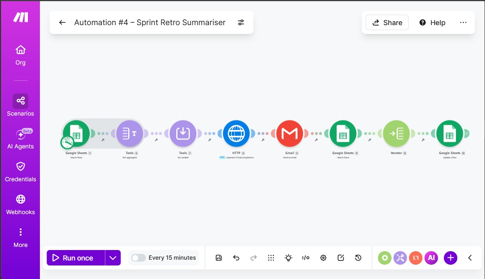

# 🔄 Automation #04 — Sprint Retro Summariser
### Automatically collect, structure, and deliver sprint retrospective summaries using AI

[](https://make.com)
[](https://groq.com)
[](https://forms.google.com)
[](https://sheets.google.com)
[](https://gmail.com)

---

## 🚨 Problem Statement

Sprint retrospectives generate valuable feedback — but the output is often scattered across sticky notes, Miro boards, or verbal discussions. Scrum Masters and PMs spend significant time after retros consolidating feedback, identifying themes, and drafting action items. Follow-through is inconsistent because the summary never gets formalised quickly enough.

**This automation turns raw retro inputs into a structured, actionable summary — instantly.**

---

## ✅ Solution

Team members submit their retro feedback via a **Google Form** (What Went Well / What Didn't / Action Items). The automation aggregates all responses, sends them to **Groq AI** for theme extraction and structuring, logs the output to **Google Sheets**, and delivers a polished retro summary via **Gmail**.

---

## 🔁 Workflow

```
Google Forms (Team submits retro feedback)
        ↓
Google Sheets (Store responses)
        ↓
Text Aggregator (Combine all feedback entries)
        ↓
Set Variable — cleanText
        ↓
HTTP Module → Groq API (Structure & summarise retro)
        ↓
Google Sheets — Get a Row (Re-expose variables)
        ↓
Google Sheets — Add Row (Log retro summary)
        ↓
Gmail (Send structured retro summary to team)
```

---

## 🧩 Module Breakdown

| # | Module | Purpose |
|---|---|---|
| 1 | Google Forms — Watch Responses | Trigger on retro form submission |
| 2 | Google Sheets — Search Rows | Fetch all retro responses for the sprint |
| 3 | Text Aggregator | Combine all team feedback into one block |
| 4 | Set Variable (cleanText) | Sanitise for AI input |
| 5 | HTTP — Groq API | Summarise and structure retro output |
| 6 | Google Sheets — Get a Row | Re-expose variables post-AI step |
| 7 | Google Sheets — Add Row | Log structured retro summary |
| 8 | Gmail — Send Email | Deliver formatted summary to team |

---

## 🤖 AI Prompt Used

```
You are an agile coach assisting with sprint retrospectives.

Below are feedback entries from the team for this sprint's retrospective.
Analyse and summarise them under three sections:

🟢 What Went Well
   - Identify common themes and specific highlights

🔴 What Didn't Go Well
   - Identify pain points and recurring issues

🎯 Action Items for Next Sprint
   - Extract concrete, actionable improvements with suggested owners if mentioned

Keep the tone constructive and professional.
Attribute key points to team members where names are provided.

Retro Feedback:
{{cleanText}}
```

---

## 📥 Google Form Fields

| Field | Type |
|---|---|
| Team Member Name | Short answer |
| Sprint Number / Name | Short answer |
| What went well this sprint? | Paragraph |
| What didn't go well? | Paragraph |
| What should we improve next sprint? | Paragraph |
| Any shoutouts or appreciation? | Paragraph (optional) |

---

## 🗂️ Google Sheet Structure

**Input Sheet (Form Responses)**
| Column | Purpose |
|---|---|
| Timestamp | Submission time |
| Name | Team member |
| Sprint | Sprint identifier |
| Went Well | Positive feedback |
| Didn't Go Well | Pain points |
| Improvements | Suggested action items |
| Shoutouts | Optional appreciation |

**Retro Summary Log**
| Column | Purpose |
|---|---|
| Sprint | Sprint name/number |
| Date | Retro date |
| Went Well Summary | AI-consolidated positives |
| Improvement Areas | AI-consolidated pain points |
| Action Items | Structured next-sprint actions |

---

## ⚙️ Technical Notes

- **Trigger:** Google Forms — Watch Responses
- **Key Workaround:** `Google Sheets → Get a Row` added after Groq response step to re-expose variables invisible after Text Aggregator
- **Groq Model:** `llama-3.3-70b-versatile`
- **Temperature:** 0.5 (balanced — structured but readable narrative)
- **API Response Path:** `data → choices → [] → message → content`
- **Notes:** ⚠️ API keys and personal credentials have been removed from the blueprint. Replace placeholders before importing.
  
---

## 📧 Sample Output

```
Sprint Retrospective Summary — Sprint 14

🟢 What Went Well
  • Strong collaboration between dev and QA teams (mentioned by 4 members)
  • Client demo went smoothly — well prepared
  • Daily standups were focused and time-boxed

🔴 What Didn't Go Well
  • UAT environment instability caused delays (3 members flagged)
  • Scope creep mid-sprint from client change requests
  • Some action items from Sprint 13 were not completed

🎯 Action Items for Sprint 15
  1. DevOps to stabilise UAT environment before Sprint 15 start — Owner: Ravi
  2. PM to enforce change request freeze after Sprint planning — Owner: Allavudeen
  3. Review carry-forward items at Sprint planning — Owner: Scrum Master
```

---

## 💡 Consulting Insight

> Retrospectives are the engine of continuous improvement in agile teams — but only if the output is captured and acted on. This automation ensures every retro produces a structured, archived, and distributed summary within minutes. It also builds a historical record of team health across sprints — invaluable for agile coaching engagements. Estimated time saving: **1–2 hours per sprint.**

---

## 📸 Screenshots



---

*Part of the [Make.com Automation Suite](../README.md) | [Back to Portfolio](../../README.md)*
