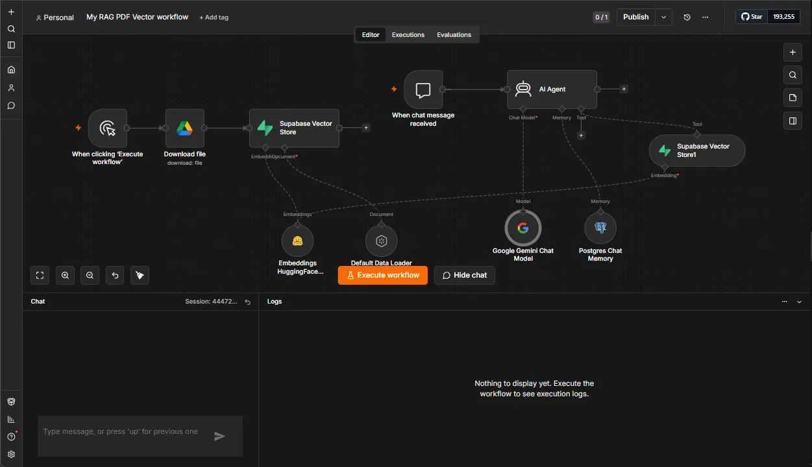
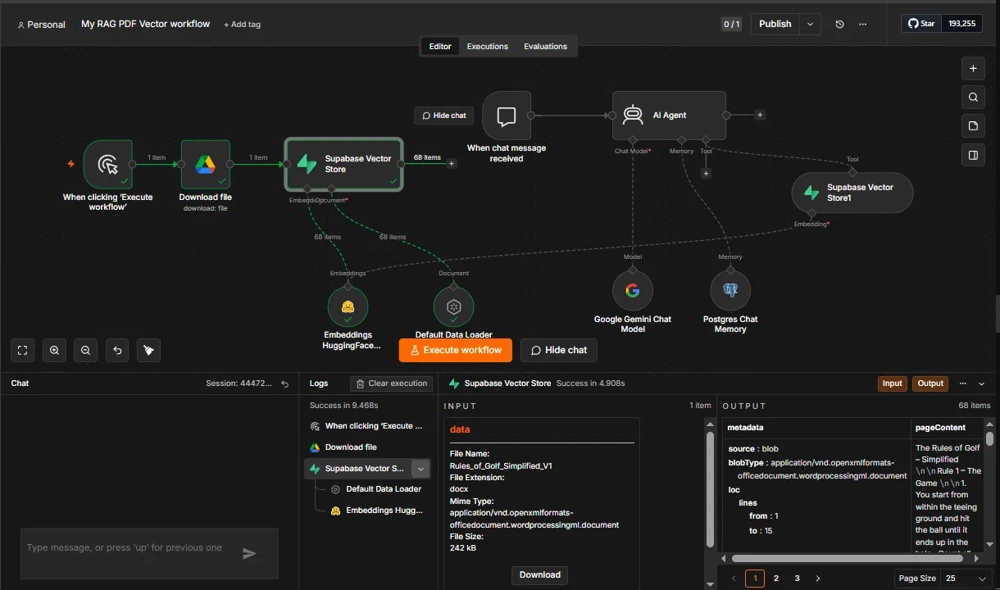
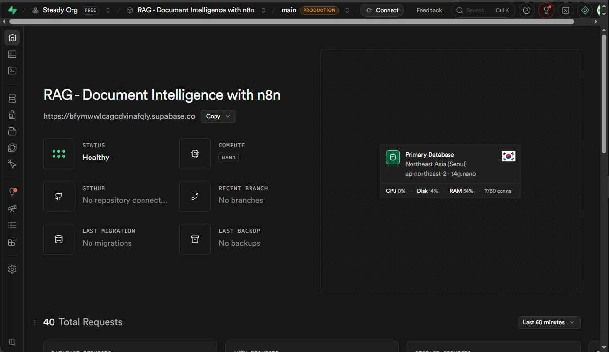
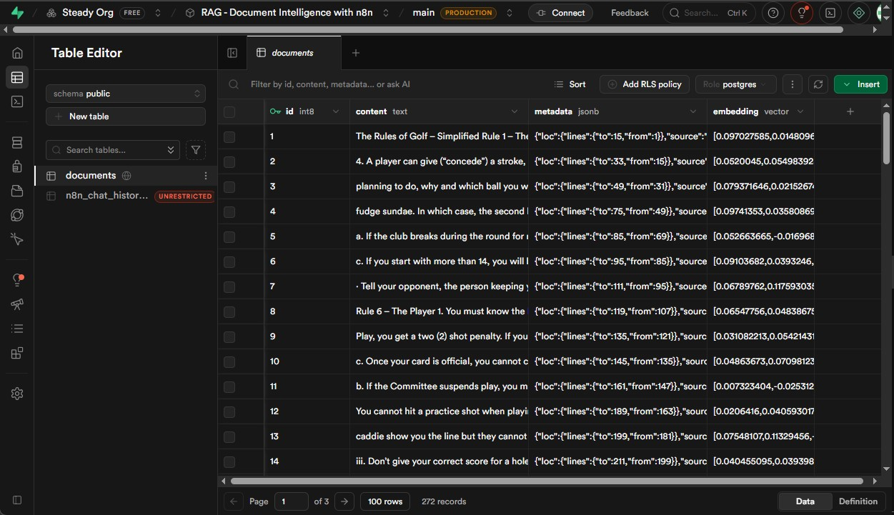
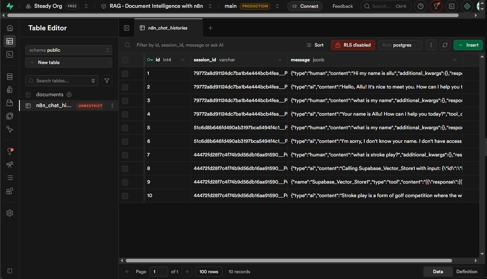
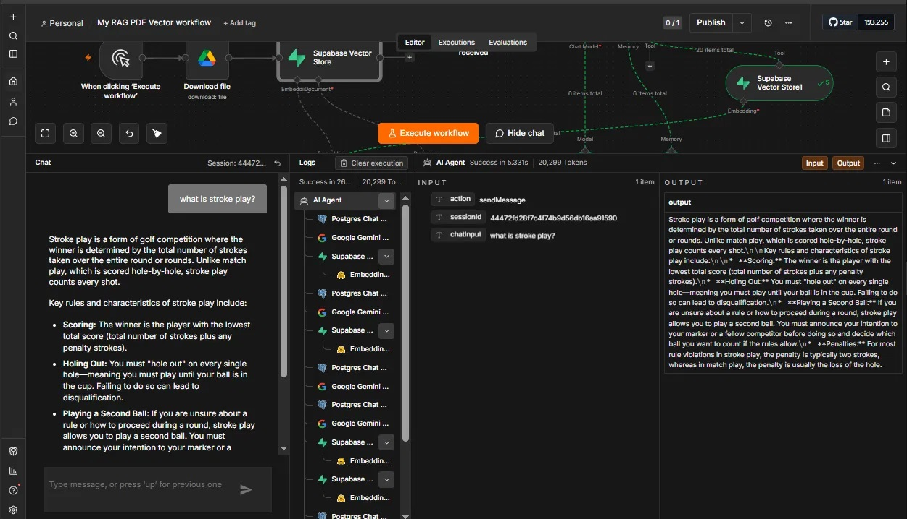

# RAG Document Intelligence Agent

An AI-powered document query system built with n8n, Supabase, HuggingFace, and Google Gemini. Upload any document once — your team can query it conversationally forever.

---

## What It Does

Most teams store knowledge in documents nobody reads.
This workflow changes that.

Feed it any document (DOCX, PDF). It chunks, embeds, and stores it in a vector database. From that point, anyone can ask questions in plain English and get precise, context-aware answers — instantly.

Every conversation is remembered across sessions via Postgres memory. No context lost between chats. Every interaction is logged and auditable.

---

## Tech Stack

| Layer | Tool |
|---|---|
| Orchestration | n8n (self-hosted via Docker) |
| Document Source | Google Drive |
| Chunking + Embedding | HuggingFace API — `sentence-transformers/all-MiniLM-L6-v2` |
| Vector Store | Supabase (pgvector) — `documents` table |
| LLM | Google Gemini (`gemini-2.0-flash`) |
| Conversation Memory | PostgreSQL — `n8n_chat_histories` table |

---

## Architecture

Both flows live in a single n8n canvas for clarity.

### Flow 1 — Ingestion Pipeline (run once per document)

```
Manual trigger (Execute Workflow)
→ Download file (Google Drive)
→ Default Data Loader (chunk document)
→ HuggingFace Embeddings (vectorize chunks)
→ Supabase Vector Store (store vectors in documents table)
```

### Flow 2 — Query Pipeline (runs on every chat message)

```
When chat message received
→ AI Agent (Google Gemini)
→ Supabase Vector Store1 (retrieve top 5 relevant chunks as tool)
→ Postgres Chat Memory (load + save session history)
→ Structured answer returned to chat
```

---

## Key Design Decisions

- **Single canvas, two flows** — ingestion and query live together for easy understanding and debugging
- **Postgres Chat Memory over Simple Memory** — conversations persist across sessions, not just within one chat; fully auditable via `n8n_chat_histories` table
- **HuggingFace for embeddings** — open source, cost-efficient, no vendor lock-in; `all-MiniLM-L6-v2` is a well-benchmarked semantic search model
- **Supabase Vector Store as AI Agent Tool** — the agent decides when to query the vector store based on context, not a hardcoded trigger
- **Google Gemini for generation** — multimodal capable LLM with strong reasoning for document Q&A

---

## Supabase Tables

### documents (Vector Store)
| Column | Type | Description |
|---|---|---|
| id | int8 | Auto-increment primary key |
| content | text | Raw text chunk from document |
| metadata | jsonb | Source info (line numbers, file name) |
| embedding | vector | HuggingFace embedding array |

### n8n_chat_histories (Postgres Memory)
| Column | Type | Description |
|---|---|---|
| id | int4 | Auto-increment primary key |
| session_id | varchar | Unique session identifier |
| message | jsonb | Full message object (human/ai/tool) |

> ⚠️ **Security Note:** Enable RLS (Row Level Security) on `n8n_chat_histories` table before production use to prevent unauthorized access to conversation history.

> ⚠️ **Duplicate Vectors Note:** Running the ingestion flow multiple times will add duplicate chunks to the `documents` table. Clear the table before re-ingesting the same document.

---

## Setup Guide

### Prerequisites
- n8n running locally via Docker
- Supabase account (free tier works)
- HuggingFace API account
- Google Gemini API key
- Google Drive with your document uploaded
- Postgres database (Supabase provides this)

### Supabase Setup
Run this SQL in your Supabase SQL Editor to enable vector support:

```sql
-- Enable pgvector extension
create extension if not exists vector;

-- Create documents table
create table documents (
  id bigserial primary key,
  content text,
  metadata jsonb,
  embedding vector(384)
);

-- Create match function for similarity search
create or replace function match_documents (
  query_embedding vector(384),
  match_count int default 5
) returns table (
  id bigint,
  content text,
  metadata jsonb,
  similarity float
)
language plpgsql
as $$
begin
  return query
  select
    documents.id,
    documents.content,
    documents.metadata,
    1 - (documents.embedding <=> query_embedding) as similarity
  from documents
  order by documents.embedding <=> query_embedding
  limit match_count;
end;
$$;
```

### Credential Placeholders
Replace these in the workflow JSON before importing into n8n:

```
YOUR_GOOGLE_DRIVE_FILE_ID       → Google Drive file ID of your document
YOUR_GOOGLE_DRIVE_FILE_URL      → Full Google Drive URL of your document
YOUR_CREDENTIAL_ID              → n8n credential ID (all 4 occurrences)
YOUR_N8N_INSTANCE_ID            → Your n8n instance ID
YOUR_WEBHOOK_ID                 → Auto-generated on import
YOUR_WORKFLOW_ID                → Auto-generated on import
YOUR_VERSION_ID                 → Auto-generated on import
```

### Steps
1. Import `workflow.json` into your n8n instance
2. Set up credentials in n8n for: Google Drive, Supabase, HuggingFace, Google Gemini, Postgres
3. Upload your document to Google Drive
4. Update the Google Drive file ID in the Download File node
5. Run the left flow once (Execute Workflow) to ingest the document
6. Verify chunks in Supabase → Table Editor → documents table
7. Start chatting in the right flow chat window

---

## Screenshots

### 1. n8n Workflow Canvas (Dual Flow)


### 2. Ingestion Execution (68 chunks stored)


### 3. Supabase Dashboard (Healthy)


### 4. Documents Table (Vector Embeddings)


### 5. Chat Histories Table (Postgres Memory)


### 6. Q&A Output (Stroke Play Query)


---

## Agile Domain Use Cases

This was tested with a Golf rules document as proof of concept. For Agile teams, point it at:

- Team handbook or onboarding guide
- Sprint process documentation
- Definition of Done / Definition of Ready
- Retrospective action log archive
- Client requirement documents
- SLA or compliance policy documents

New team members can query instead of reading 40 pages of docs. Stakeholders get instant answers from your process documents. Every question and answer is logged for audit.

---

## Freelancing Potential

| Package | Scope | Price Range |
|---|---|---|
| Starter | Single document, basic Q&A | $400–600 |
| Team | Up to 5 documents, multi-user | $800–1200 |
| Enterprise | Unlimited docs, RLS, audit trail | $2000+ |

**Target clients:** HR teams (policy docs), Agile coaches (process docs), legal teams (contract Q&A), ops managers (SOPs)

---

## Part of the AI-Augmented Agile Portfolio

This workflow is part of a broader consulting portfolio demonstrating AI + automation applied to Agile project management.

- **Make.com Series** → Structured, scheduled Agile automations
- **n8n Series** → Agentic, conversational AI workflows

🔗 Full portfolio: [github.com/Allavudeen/ai-automation-consulting](https://github.com/Allavudeen/ai-automation-consulting)

---

*Credentials sanitized. Replace all placeholder values before use.*
*Supabase free tier pauses after 1 week of inactivity — unpause from dashboard before testing.*
