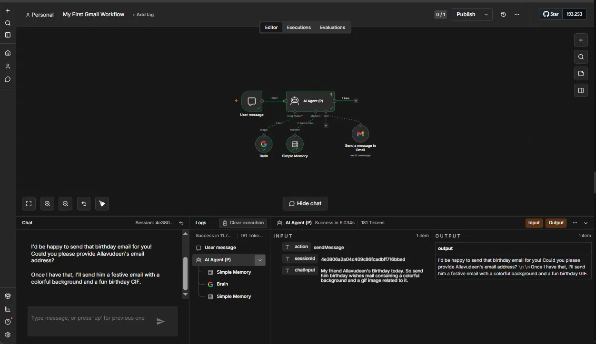
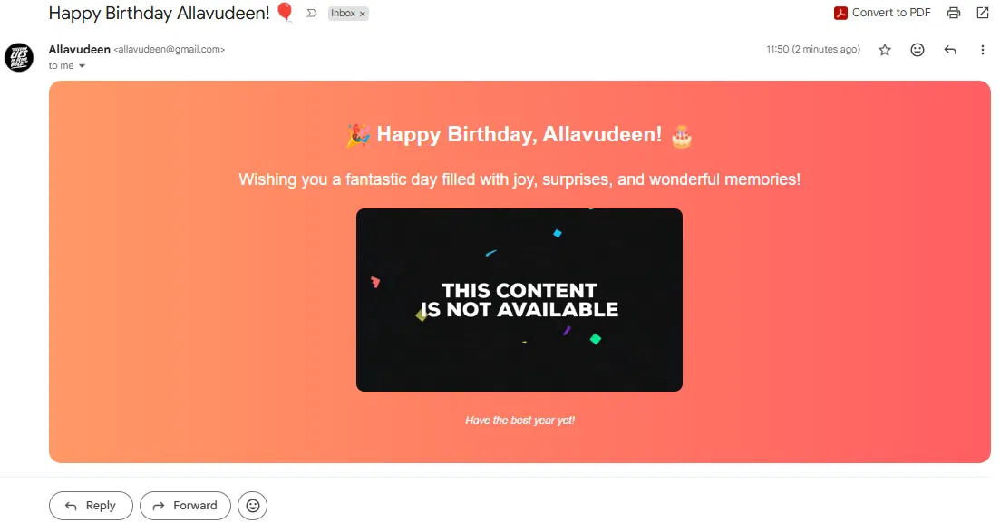

# Automation #02 — Conversational Email Agent

## Overview

A conversational AI Agent built on n8n (self-hosted via Docker) that lets you send emails through natural language chat. Simply describe what you want to send and to whom — the agent asks for any missing details before taking action.

**No rigid forms. No fixed templates. Just a conversation.**

---

## Problem It Solves

Sending emails usually means opening a client, filling fields, and writing content manually. This agent turns that into a natural language interaction — type a message like *"Send a birthday email to my friend"* and the agent handles the rest, including asking for the recipient's email if not provided.

---

## Workflow Architecture

```
Chat Trigger (n8n UI)
        │
        ▼
  AI Agent Node (Gemini gemini-3-flash-preview)
        │
   ┌────┴────┐
   │         │
Simple    Gmail Tool
Memory    (Send Message)
```

### Node Breakdown

| Node | Role |
|------|------|
| **Chat Trigger** | Accepts natural language input from n8n's built-in chat UI |
| **AI Agent** | Orchestrates the conversation using Gemini gemini-3-flash-preview |
| **Simple Memory** | Retains conversation context across multiple turns |
| **Gmail Tool** | Executes the email send action when all required info is collected |

---

## Key Features

- **Conversational by design** — if you forget to provide the recipient's email, the agent asks for it before proceeding
- **Context-aware memory** — remembers prior messages within the same session
- **Rich email output** — generates HTML-formatted emails with appropriate styling, emojis, and content
- **Self-hosted** — runs locally via Docker, no cloud dependency for the automation layer
- **Natural language interface** — no forms, no rigid input structure

---

## Tech Stack

| Component | Tool |
|-----------|------|
| Automation Platform | n8n (self-hosted via Docker) |
| LLM | Google Gemini — `gemini-3-flash-preview` (via PaLM API) |
| Memory | n8n Simple Memory node |
| Email Service | Gmail (via n8n Gmail node) |
| Interface | n8n built-in Chat UI |

---

## Live Demo Flow

**User:** `My friend Allavudeen's Birthday today. So send him birthday mail containing a colorful background and a gif image related to it.`

**Agent:** `I'd be happy to send that birthday email for you! Could you please provide Allavudeen's email address? Once I have that, I'll send him a festive email with a colorful background and a fun birthday GIF.`

**User:** `allavudeen@gmail.com`

**Agent:** ✅ Sends a beautifully formatted HTML birthday email with colorful gradient background and GIF.

---

## Screenshots

### Workflow Canvas


### Email Output


---

## Setup Instructions

### Prerequisites
- Docker installed and running
- n8n running locally via Docker
- Google Gemini API key (PaLM API)
- Gmail account connected via n8n credentials

### Run n8n via Docker
```bash
docker run -it --rm \
  --name n8n \
  -p 5678:5678 \
  -v ~/.n8n:/home/node/.n8n \
  n8nio/n8n
```

### Import Workflow
1. Open n8n at `http://localhost:5678`
2. Go to **Workflows → Import**
3. Upload `workflow.json`
4. Configure credentials:
   - **Google Gemini (PaLM) API** — add your API key
   - **Gmail** — connect your Gmail account via OAuth
5. Activate the workflow and open the **Chat** panel

---

## Folder Structure

```
automation-02-conversational-email-agent/
├── README.md
├── workflow.json          # n8n workflow export (credentials removed)
├── screenshots/
│   ├── 01_workflow.png    # n8n canvas view
│   └── 02_gmail.png       # Sample email output
└── sample-output.txt      # Sample agent conversation log
```

---

## Agile / PM Use Cases

This agent pattern is directly applicable in Agile and project management contexts:

- **Sprint notifications** — "Send an email to the team that tomorrow's standup is cancelled"
- **Stakeholder updates** — "Email the client a summary of this week's progress"
- **Escalation alerts** — "Send an urgent email to the project lead about the blocker raised today"
- **Retrospective summaries** — "Email the retro outcomes to all team members"

---

## Part of the AI-Augmented Agile Suite

This automation is part of a broader portfolio of AI-powered workflow automations designed for Agile teams and project managers.

| Platform | Automation |
|----------|-----------|
| Make.com | [Automation #01 — Daily Standup Summariser](../../make-dot-com/automation-01-standup-summariser/) |
| Make.com | [Automation #02 — Weekly Status Report Generator](../../make-dot-com/automation-02-weekly-status-r...) |
| Make.com | [Automation #03 — Meeting Action Item Tracker](../../make-dot-com/automation-03-meeting-action-...) |
| Make.com | [Automation #04 — Sprint Retro Summariser](../../make-dot-com/automation-04-sprint-retro-su...) |
| Make.com | [Automation #05 — Blocker Escalation Bot](../../make-dot-com/automation-05-blocker-escalati...) |
| n8n | [Automation #01 — RAG Document Intelligence Agent](../automation-01-rag-document-intelligence-agent/) |
| n8n | **Automation #02 — Conversational Email Agent** ← You are here |

---

## Author

**Allavudeen** — AI-Augmented Agile Consultant & Automation Specialist
- GitHub: [github.com/Allavudeen/ai-automation-consulting](https://github.com/Allavudeen/ai-automation-consulting)
- LinkedIn: [linkedin.com/in/allavudeen](https://linkedin.com/in/allavudeen)
