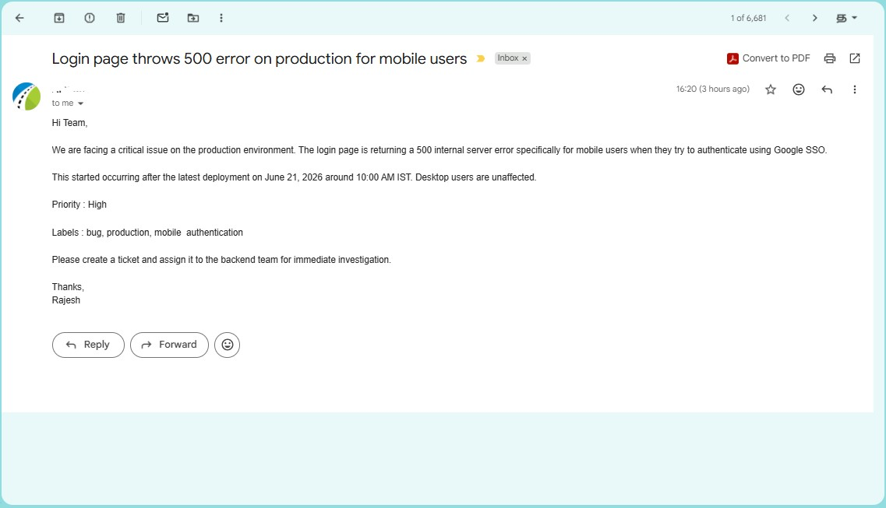
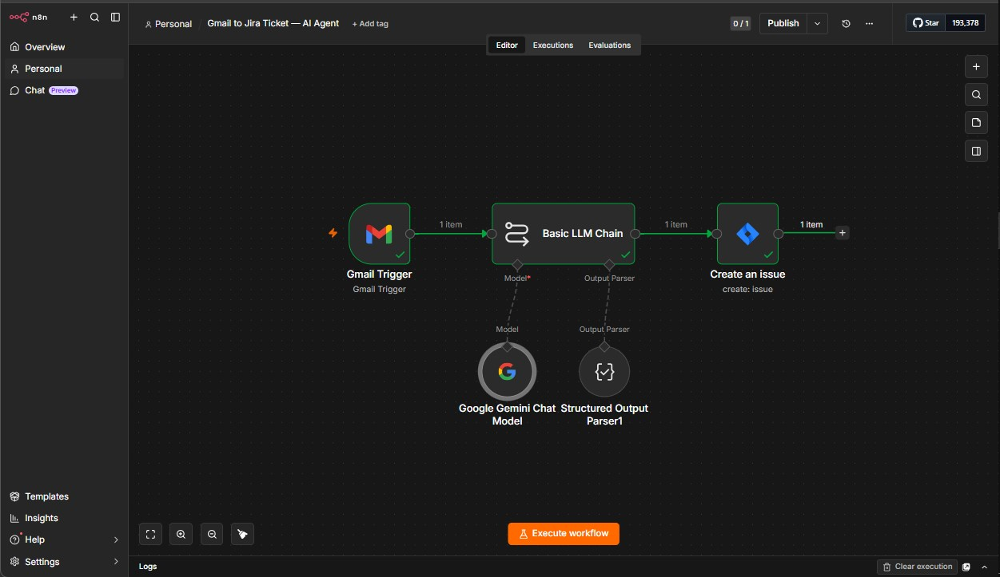
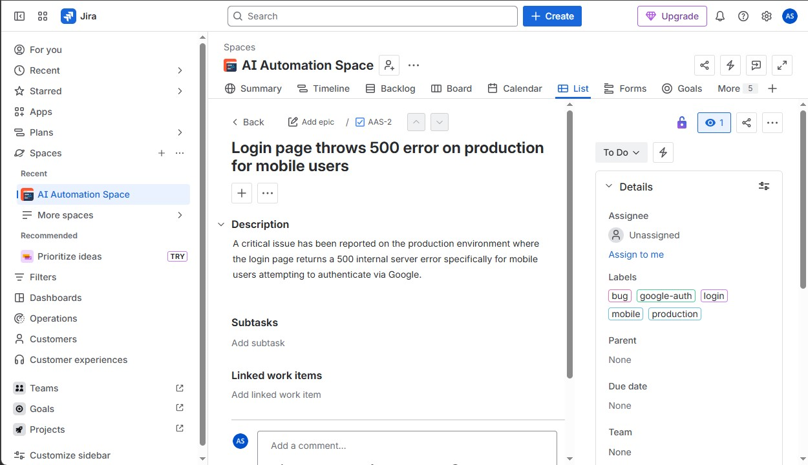

# Automation #03 — Gmail to Jira Ticket AI Agent

## Overview

An AI-powered workflow built on n8n (self-hosted via Docker) that monitors a Gmail inbox and automatically creates structured Jira tickets from incoming emails — with zero manual input.

**Someone sends an email describing an issue. A Jira ticket appears. That's it.**

---

## Problem It Solves

In Agile teams, issues and bugs are often reported via email — but turning those emails into Jira tickets requires someone to manually read, interpret, and fill in the ticket fields. This workflow eliminates that step entirely by using Gemini AI to extract the right information and create the ticket automatically.

---

## Workflow Architecture

```
Gmail Trigger (new email received)
        │
        ▼
Basic LLM Chain (Google Gemini gemini-3-flash-preview)
        │                    │
        ▼                    ▼
Google Gemini          Structured Output
Chat Model                  Parser
        │
        ▼
Jira — Create Issue (AI Automation Space)
```

### Node Breakdown

| Node | Role |
|------|------|
| **Gmail Trigger** | Polls inbox every minute for new emails |
| **Basic LLM Chain** | Sends email content to Gemini with extraction prompt |
| **Google Gemini Chat Model** | `gemini-3-flash-preview` — extracts structured fields |
| **Structured Output Parser** | Enforces JSON schema on Gemini's response |
| **Create an Issue** | Creates Jira ticket with all extracted fields |

---

## Key Features

- **Fully automated** — no human intervention needed between email and Jira ticket
- **AI-powered extraction** — Gemini reads unstructured email text and outputs structured data
- **Priority mapping** — Gemini assigns priority as numeric ID (1–5) directly compatible with Jira's API
- **Smart labelling** — AI infers relevant labels from email context
- **Self-hosted** — runs locally via Docker, no cloud dependency for the automation layer
- **Structured output enforcement** — JSON schema parser ensures clean, consistent Jira field mapping

---

## Tech Stack

| Component | Tool |
|-----------|------|
| Automation Platform | n8n (self-hosted via Docker) |
| LLM | Google Gemini — `gemini-3-flash-preview` (via PaLM API) |
| Output Parser | n8n Structured Output Parser |
| Email Trigger | Gmail (OAuth2) |
| Ticket Destination | Jira Software Cloud |

---

## Priority Mapping

Gemini outputs priority as a number (1–5) which maps directly to Jira's priority IDs:

| Gemini Output | Jira Priority |
|---------------|--------------|
| 1 | Highest |
| 2 | High |
| 3 | Medium |
| 4 | Low |
| 5 | Lowest |

---

## Live Demo Flow

**Email received (from Rajesh):**
> Subject: Login page throws 500 error on production for mobile users
> Body: We are facing a critical issue on the production environment. The login page is returning a 500 internal server error specifically for mobile users when they try to authenticate using Google SSO...

**Jira ticket created automatically (AAS-2):**

| Field | AI-Extracted Value |
|-------|-------------------|
| Summary | Login page throws 500 error on production for mobile users |
| Description | A critical issue has been reported on the production environment where the login page returns a 500 internal server error specifically for mobile users attempting to authenticate via Google |
| Priority | High (ID: 2) |
| Labels | bug, google-auth, login, mobile, production |

---

## Screenshots

### Input — Email Received


### Workflow Canvas


### Output — Jira Ticket Created


---

## Setup Instructions

### Prerequisites
- Docker installed and running
- n8n running locally via Docker
- Google Gemini API key (PaLM API)
- Gmail account connected via OAuth2
- Jira Software Cloud account with API token

### Run n8n via Docker
```bash
docker run -it --rm \
  --name n8n \
  -p 5678:5678 \
  -v ~/.n8n:/home/node/.n8n \
  n8nio/n8n
```

### Import Workflow
1. Open n8n at `http://localhost:5678`
2. Go to **Workflows → Import**
3. Upload `workflow.json`
4. Configure credentials:
   - **Google Gemini (PaLM) API** — add your API key
   - **Gmail** — connect via OAuth2
   - **Jira Software Cloud** — add your Atlassian email + API token
5. Update the Jira node:
   - Select your **Project**
   - Select **Issue Type** (Task/Bug)
6. Activate the workflow

### Jira API Token
Generate at: `https://id.atlassian.com/manage-profile/security/api-tokens`

---

## Extraction Prompt

```
You are an AI assistant that extracts structured information from emails to create Jira tickets.

Extract the following fields from the email below and respond ONLY in valid JSON format with no extra text:

{
  "summary": "one-line title of the issue",
  "description": "detailed description of the issue",
  "priority": "1 or 2 or 3 or 4 or 5",
  "labels": ["label1", "label2"]
}

Email Subject: {{ $json.Subject }}
Email Body: {{ $json.snippet }}
```

---

## Folder Structure

```
automation-03-gmail-to-jira-ticket-ai-agent/
├── README.md
├── workflow.json               # n8n workflow export (credentials removed)
├── screenshots/
│   ├── 01_email.png            # Sample trigger email
│   ├── 02_n8n_canvas.png       # n8n workflow canvas
│   └── 03_jira_ticket.png      # Jira ticket created
└── sample-output.txt           # Sample extracted JSON output
```

---

## Agile / PM Use Cases

- **Bug reports** — developer emails a bug → Jira ticket created instantly
- **Client requests** — client emails a feature request → ticket created with correct priority
- **Production incidents** — on-call engineer emails an incident → P1 ticket raised automatically
- **Sprint blockers** — team member emails a blocker → ticket created and ready for triage

---

## Part of the AI-Augmented Agile Suite

This automation is part of a broader portfolio of AI-powered workflow automations designed for Agile teams and project managers.

| Platform | Automation |
|----------|-----------|
| Make.com | Automation #01 — Daily Standup Summariser |
| Make.com | Automation #02 — Weekly Status Report Generator |
| Make.com | Automation #03 — Meeting Action Item Tracker |
| Make.com | Automation #04 — Sprint Retro Summariser |
| Make.com | Automation #05 — Blocker Escalation Bot |
| n8n | Automation #01 — RAG Document Intelligence Agent |
| n8n | Automation #02 — Conversational Email Agent |
| n8n | **Automation #03 — Gmail to Jira Ticket AI Agent** ← You are here |

---

## Author

**Allavudeen** — AI-Augmented Agile Consultant & Automation Specialist
- GitHub: [github.com/Allavudeen/ai-automation-consulting](https://github.com/Allavudeen/ai-automation-consulting)
- LinkedIn: [linkedin.com/in/allavudeen](https://linkedin.com/in/allavudeen)
