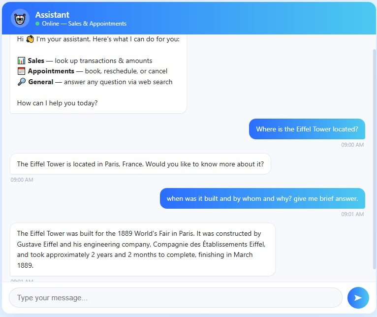
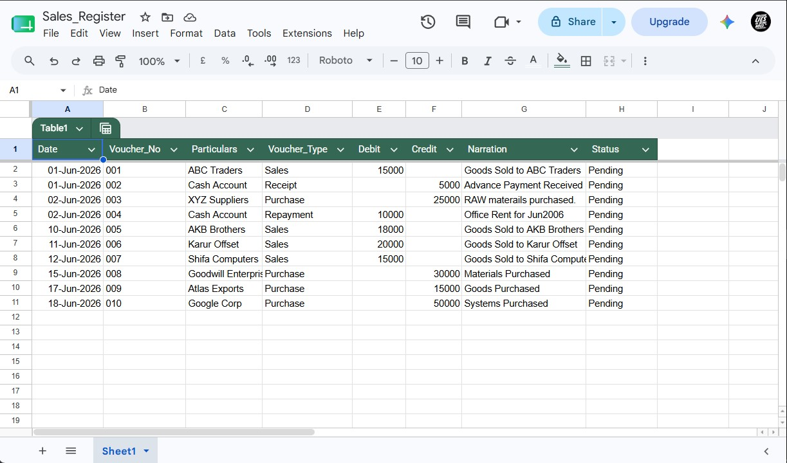
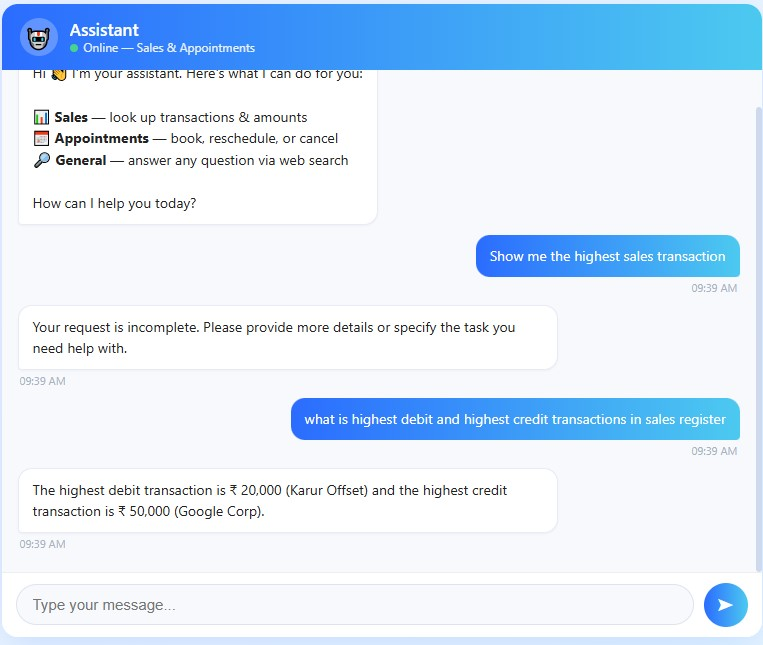
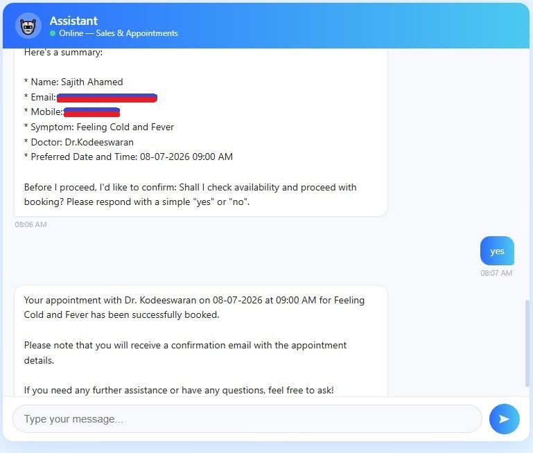
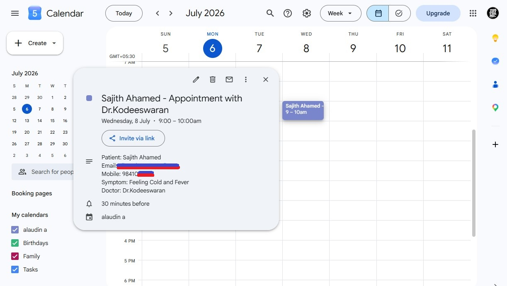
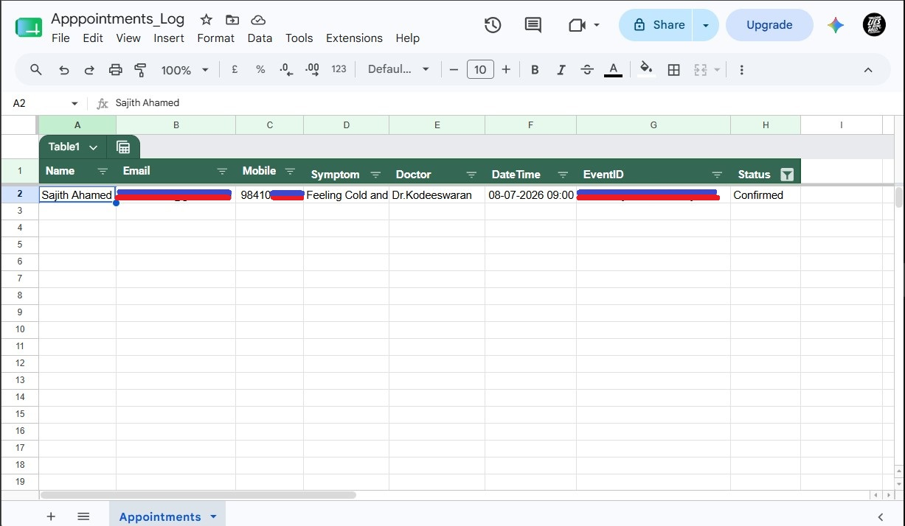
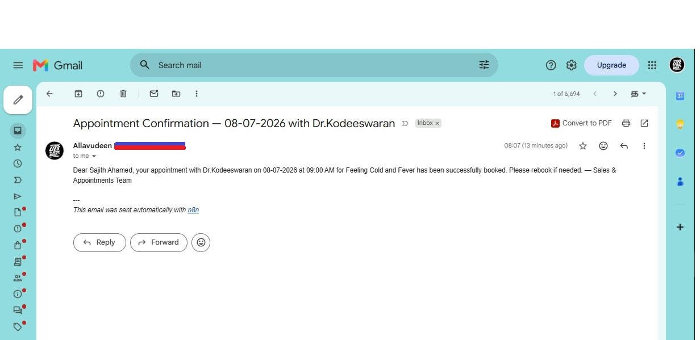

# 🏥 n8n #04 — AI-Powered Appointment & Sales Agent (MCP + RAG Architecture)

An end-to-end conversational AI agent built on n8n using Model Context Protocol (MCP) and RAG-style data querying. Handles full appointment lifecycle — booking, rescheduling, and cancellation — plus real-time sales register lookup and general web search, all via a single mobile-responsive chat UI.

Google Calendar is the single source of truth. Google Sheets serves as both a write-only appointment audit log and a RAG-queryable sales data source.

---

## 🛠 Tech Stack


---

## 🧠 Architecture Overview

```
User (Chat UI)
      │
      ▼
n8n AI Agent (Groq LLM)
      │
      ├── MCP Tools
      │     ├── Google Calendar  ← Book / Reschedule / Cancel events
      │     ├── Google Sheets    ← Appointment audit log + Sales RAG source
      │     └── Gmail            ← Confirmation & cancellation emails
      │
      ├── SerpApi               ← General web search queries
      │
      └── RAG Layer
            └── Sheets query    ← Sales register lookup (transaction & amount)
```

---

## ✅ Features

### 📅 Appointment Management (MCP)
- **Book** — Collects Name, Email, Mobile, Symptom, Doctor; checks slot availability; creates Calendar event; logs to Sheets; sends Gmail confirmation
- **Reschedule** — Fetches live EventID from Calendar; verifies new slot availability; updates Calendar + Sheets + Gmail
- **Cancel** — Fetches appointments by email; confirms with user; deletes from Calendar; logs cancellation timestamp; sends Gmail notification

### 📊 Sales Register Lookup (RAG)
- Query Google Sheets sales data conversationally
- Look up highest transactions, amounts by date, sales by party/category
- RAG-style retrieval — agent reads and reasons over Sheets rows in real time

### 🔎 General Web Search (SerpApi)
- Answer any question outside appointments and sales
- Live web search via SerpApi integrated directly into the same chat

---

## 🗂 Key Design Decisions

| Decision | Rationale |
|---|---|
| Google Calendar = Source of Truth | All reschedule/cancel ops fetch live EventID from Calendar, never from Sheets |
| Sheets = Dual Role | Write-only audit log for appointments AND RAG data source for sales queries |
| MCP Architecture | Clean tool routing; agent decides which tool to call based on user intent |
| RAG on Sheets | No vector DB needed; agent retrieves and reasons over structured sales rows directly |
| ISO 8601 + IST | All Calendar API calls use `YYYY-MM-DDTHH:MM:SS+05:30`; display uses 12-hour AM/PM |
| Cancellation timestamp | `new_datetime` on cancel records the exact time of cancellation for audit trail |
| `$fromAI()` expressions | Single-line only; no line breaks inside `{{ }}` |

---

## 📁 Folder Structure

```
n8n/
└── automation-04-appointment-management-agent/
    ├── workflow.json        ← Sanitized n8n workflow export
    ├── index.html           ← Mobile-responsive chat UI
    ├── screenshots/         ← Demo screenshots
    └── README.md
```

---

## 📸 Screenshots

### 🌐 Chat UI — General Web Search
> Ask anything via SerpApi — live web search directly in the chat



---

### 📊 Sales Register — Google Sheets Data Source
> Structured sales data in Sheets used as RAG source for conversational queries



---

### 💬 Chat UI — Sales Register Query (RAG)
> "What is the highest debit and credit transaction?" — answered from Sheets in real time



---

### 📅 Chat UI — New Appointment Booking
> Agent collects patient details, confirms slot, books appointment end-to-end



---

### 🗓 Google Calendar — Appointment Created
> Full patient context (Name, Email, Mobile, Symptom, Doctor) stored in every event



---

### 📋 Google Sheets — Appointment Audit Log
> Every booking, reschedule, and cancellation timestamped and tracked



---

### 📧 Gmail — Confirmation Email
> Automatic confirmation email sent to patient immediately after booking



---

## 🔗 Connect

[](https://www.linkedin.com/in/allavudeen)
[](https://github.com/Allavudeen/ai-automation-consulting)
[](https://www.upwork.com)

