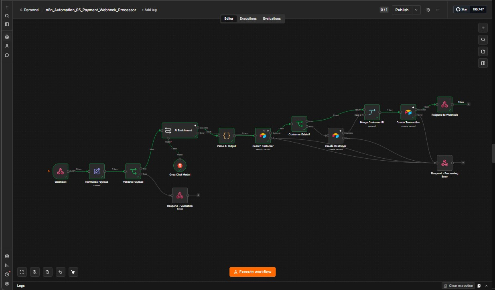
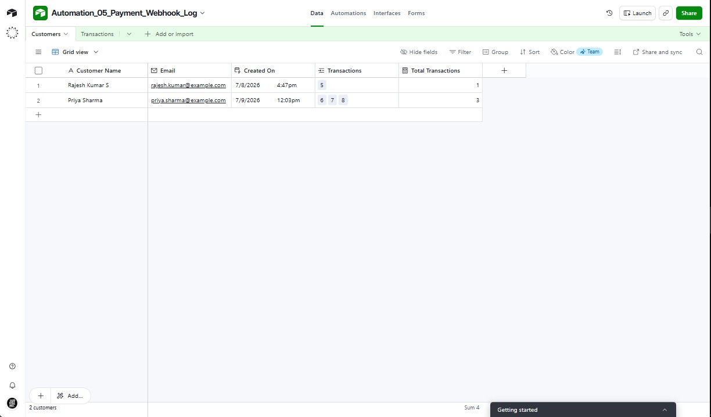
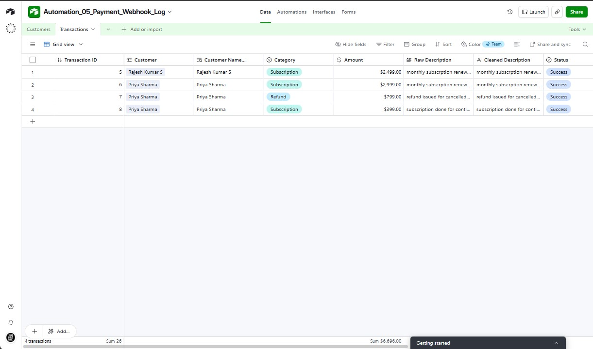

# n8n Automation #05 — AI-Enriched Payment Webhook Processor

An n8n workflow that receives payment events over a webhook, validates and normalizes the payload, uses a Groq-hosted LLM to clean and classify the transaction, then writes structured, linked records into Airtable — with full error handling on every external call.


---

## What it does

Payment platforms (Stripe, Razorpay, a custom checkout, etc.) send messy, inconsistent transaction data — inconsistent name casing, free-text descriptions, no fixed category. This workflow turns that raw webhook payload into a clean, queryable, linked record set in Airtable, without any manual data entry.

1. **Receives** a payment event via webhook (POST).
2. **Normalizes** the payload into a flat, predictable structure.
3. **Validates** required fields — bad requests are rejected with a 400 before anything downstream runs.
4. **Enriches with AI** — a Groq-hosted LLM title-cases the customer name and classifies the transaction into one of five fixed categories (Payment / Refund / Subscription / Chargeback / Other) based on the free-text description.
5. **Looks up or creates** the customer in Airtable.
6. **Writes** the transaction as a linked record against that customer.
7. **Responds** to the caller with a success or error payload.

## Architecture



```
Webhook (POST)
   └─▶ Normalize Payload (Set)
         └─▶ Validate Payload (IF)
               ├─ true  ─▶ AI Enrichment (Groq LLM)
               │             ├─ success ─▶ Parse AI Output (Code)
               │             │                └─▶ Search Customer (Airtable)
               │             │                       ├─ found     ─▶ Customer Exists? (IF: id not empty)
               │             │                       │                  ├─ true  ─▶ Merge Customer ID ─┐
               │             │                       │                  └─ false ─▶ Create Customer ───┤
               │             │                       └─ error ────▶ Respond – Processing Error          │
               │             └─ error ──▶ Respond – Processing Error                                    │
               │                                                                                          ▼
               │                                                                            Create Transaction (Airtable)
               │                                                                                 ├─ success ─▶ Respond to Webhook (200)
               │                                                                                 └─ error   ─▶ Respond – Processing Error (500)
               └─ false ─▶ Respond – Validation Error (400)
```

Every node that calls an external API (**AI Enrichment**, **Search Customer**, **Create Customer**, **Create Transaction**) is set to `Continue Using Error Output`, and every error branch converges on a single **Respond – Processing Error** node. One error contract for the whole workflow, instead of four different failure messages.

## Sample input (mock data)

```json
POST /webhook/payment-webhook-05
{
  "customer": {
    "name": "priya sharma",
    "email": "priya.sharma@example.com"
  },
  "transaction": {
    "amount": 2999,
    "currency": "INR",
    "description": "monthly subscrption renewal for pro plan",
    "timestamp": "2026-07-09T12:03:00+05:30"
  }
}
```

The AI Enrichment step turns `"priya sharma"` → `"Priya Sharma"` and classifies the (misspelled) description as `Subscription` — no hand-written regex or keyword list required.

## Data model (Airtable)

**`Customers`**
| Field | Type |
|---|---|
| Customer Name | Single line text |
| Email | Email |
| Created On | Created time |
| Transactions | Linked record (→ Transactions) |
| Total Transactions | Count (rollup) |

**`Transactions`**
| Field | Type |
|---|---|
| Transaction ID | Autonumber |
| Customer | Linked record (→ Customers) |
| Category | Single select: Payment / Refund / Subscription / Chargeback / Other |
| Amount | Currency |
| Raw Description | Single line text |
| Cleaned Description | Single line text |
| Status | Single select: Success / Failed / Pending |
| Received At | Date + time |
| Raw Payload | Long text (full original JSON, for audit/debug) |




Tested end-to-end with 2 customers and 4 transactions spanning three categories (Subscription, Refund) with all records correctly linked.

## Key technical decisions

- **New-vs-existing customer logic without a database join**: `Search Customer` runs with `Always Output Data: ON` so a "not found" doesn't halt the branch. An IF node checks whether `$json.id` is populated to route to either `Create Customer` or straight to `Merge Customer ID`.
- **Merge node in Append mode, not "Choose Branch"**: since only one of the two branches (existing vs. newly-created customer) ever fires per execution, Append cleanly reunites them into a single item without needing to match on a key.
- **Linked record syntax**: Airtable's linked-record fields expect an array of record IDs, not a bare string — `{{ [$json.id] }}`, not `{{ $json.id }}`. This one is easy to miss and fails silently otherwise.
- **AI output parsing has a safety net**: the Code node strips ```` ```json ```` fences before `JSON.parse()`, in case the model ever wraps its response in markdown despite the system prompt saying not to.
- **State carried across async branches**: after the AI call, the Code node rebuilds the working item with `{ ...$('Validate Payload').first().json, cleaned_name, category }` — pulling the original normalized fields back in by node reference, since they'd otherwise be lost after passing through the LLM node.

## Tech stack

`n8n` · `Groq (meta-llama/llama-4-scout-17b-16e-instruct)` · `Airtable` · JavaScript (Code node)

## Related automations

- [n8n #04 — AI-Powered Appointment Management Agent](#) — MCP client/server architecture, Google Calendar as source of truth
- [n8n #03 — Gmail to Jira Ticket AI Agent](#) — Gemini + Structured Output Parser
- [Make.com #05 — Blocker Escalation Bot](#) — Slack-integrated retro/standup automation

---
*Part of a 30-automation portfolio exploring AI-augmented workflow automation for Agile/PM use cases. Built by Allavudeen — offshore TPM transitioning into AI Workflow Automation Consulting.*
