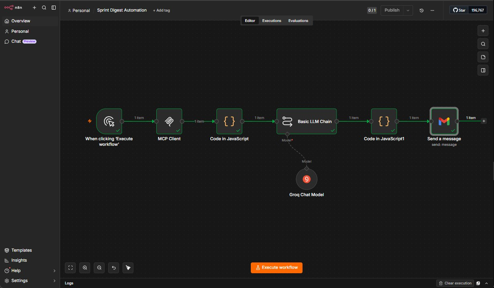
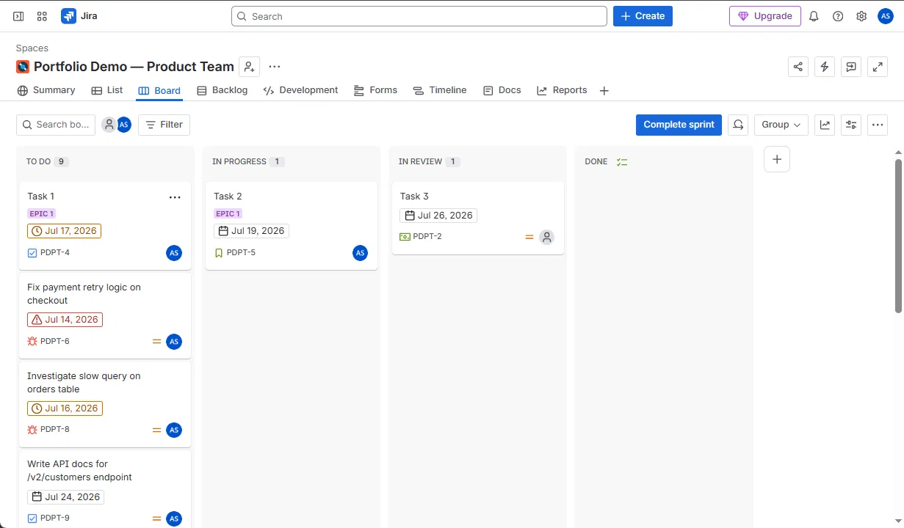
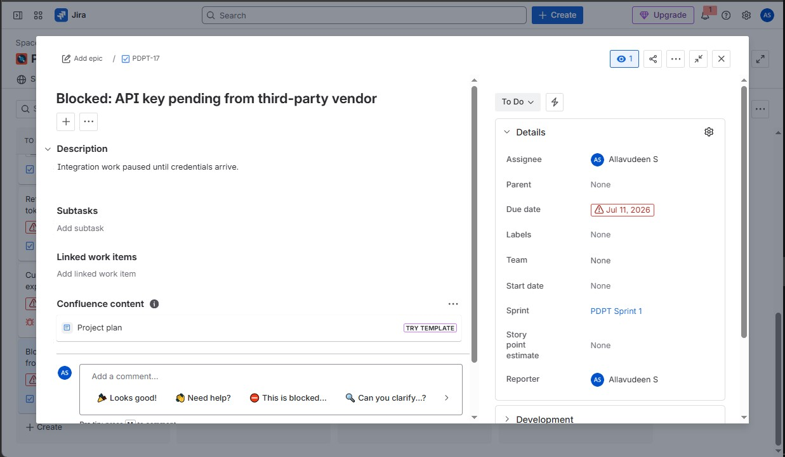
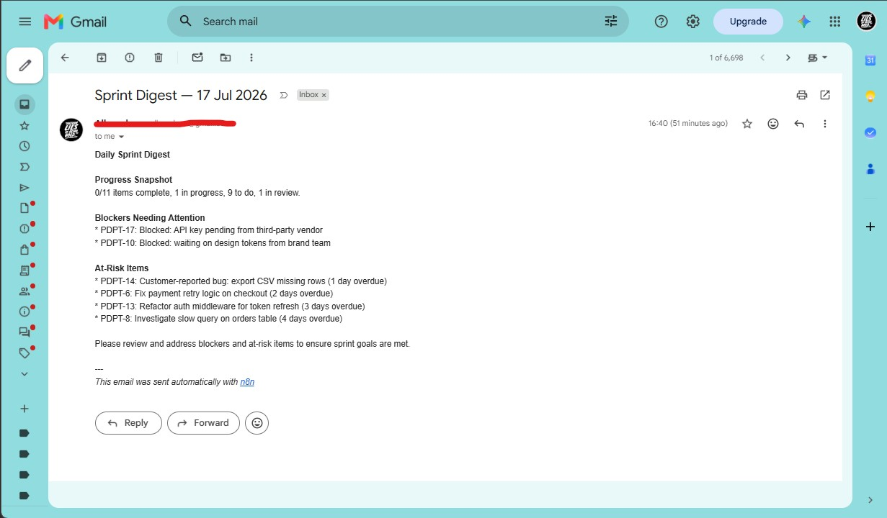

# n8n Automation #06 — Sprint Digest Automation

An n8n workflow that connects to Jira via Atlassian's official Remote MCP server, pulls the active sprint's issues, and uses an LLM to generate a concise standup-style digest — flagging blockers and overdue items — delivered straight to your inbox every morning.

## What it does

1. Queries the active Jira sprint using JQL via the **Model Context Protocol (MCP)**
2. Parses the returned issues and classifies each one as on-track, at-risk (overdue), or blocked
3. Feeds the structured summary to a Groq-hosted LLM (`llama-4-scout-17b-16e-instruct`) to generate a readable digest
4. Converts the digest to clean HTML and sends it via Gmail

## Why this one is different

Most "Jira automation" workflows poll the REST API directly. This one integrates through **Atlassian's official Remote MCP server** — the same protocol Claude and other AI assistants use to access live Jira data — giving the workflow a standardized, tool-based interface to Jira/Confluence rather than a hand-rolled API wrapper.

**A real technical snag, and how it was solved:** at the time of building this, n8n's MCP Client node has an [open compatibility issue](https://github.com/n8n-io/n8n) with OAuth 2.1 — the auth standard Atlassian's hosted MCP server requires. Rather than stall on an unresolved upstream bug, this workflow routes through **Docker Desktop's MCP Toolkit**, which:

- Handles the OAuth 2.1 handshake with Atlassian on n8n's behalf
- Exposes a local MCP Gateway over simple Server-Sent Events (SSE) with Bearer token auth — fully supported by n8n today
- Lets n8n consume real, live Jira data through a clean local endpoint (`http://host.docker.internal:8811/sse`) without needing to solve the OAuth problem itself

This is a practical example of debugging at the protocol/infrastructure level rather than just wiring up nodes — identifying *why* a standard integration path was blocked, and engineering a reliable workaround.

## Architecture

```
Manual Trigger
    │
    ▼
MCP Client (searchJiraIssuesUsingJql via Docker MCP Gateway)
    │
    ▼
Code Node — parse issues, classify risk (on-track / at-risk / blocked)
    │
    ▼
Basic LLM Chain + Groq Chat Model — generate digest text
    │
    ▼
Code Node — convert markdown to HTML
    │
    ▼
Gmail — send digest
```

## Tech stack

- **n8n** (self-hosted via Docker Desktop)
- **Docker MCP Toolkit** — official Atlassian MCP server, OAuth 2.1 handled by Docker's gateway
- **Groq API** — `llama-4-scout-17b-16e-instruct` for digest generation
- **Gmail API** — delivery
- **Jira Cloud** — source data (sample sprint with realistic overdue/blocked issues seeded via the Jira REST API for demonstration)

## Setup

1. Create a Jira Cloud project and an active sprint with issues
2. Install Docker Desktop (4.43+) and enable the **MCP Toolkit**
3. Add the official **Atlassian** MCP server from the Docker MCP catalog to a profile, and authorize it (OAuth) against your Atlassian account
4. Start the gateway: `docker mcp gateway run --transport sse --port 8811 --profile "<your-profile-id>"`
5. Import the workflow JSON into n8n
6. Configure credentials:
   - **MCP Client** → Bearer Auth, using the token printed by the gateway on startup
   - **Groq Chat Model** → your Groq API key
   - **Gmail** → OAuth2 credential
7. Update the `cloudId` and `jql` values in the MCP Client node to match your Jira site/project
8. Run the workflow manually, or connect a Schedule Trigger for daily automated delivery (e.g. 9:00 AM)

## Known limitations / planned enhancements

- **Trigger:** currently manual for testing/demo purposes. Swapping in n8n's Schedule Trigger node (e.g. daily at 9 AM) is a drop-in change — no other part of the workflow needs to change.
- **Gateway persistence:** the Docker MCP Gateway currently runs as a foreground process. For unattended daily scheduling, it should be run as a persistent background service (Windows Task Scheduler or NSSM) so its local Bearer token doesn't need to be refreshed on every restart. Atlassian's underlying OAuth token itself refreshes automatically as long as the gateway process stays alive.
- **Audit log:** a Sheets/Airtable log of each digest run (consistent with Automations #04 and #05) is a planned enhancement, not yet implemented.

## Sample output

The digest correctly distinguishes explicit blockers from time-based risk, and calculates days-overdue automatically:

> **Daily Sprint Digest**
> **Progress Snapshot:** 0/11 items complete, behind schedule
>
> **Blockers Needing Attention**
> - PDPT-17: Blocked — API key pending from third-party vendor
> - PDPT-10: Blocked — waiting on design tokens from brand team
>
> **At-Risk Items**
> - PDPT-14: Customer-reported bug — export CSV missing rows (1 day overdue)
> - PDPT-6: Fix payment retry logic on checkout (2 days overdue)
> - PDPT-13: Refactor auth middleware for token refresh (2 days overdue)
> - PDPT-8: Investigate slow query on orders table (3 days overdue)

## Screenshots

**n8n workflow canvas:**


**Sprint board detail view:**


**Example blocked issue detail:**


**Generated digest email:**



## 🔗 Connect

[](https://www.linkedin.com/in/allavudeen)
[](https://github.com/Allavudeen/ai-automation-consulting)
[](https://www.upwork.com)
