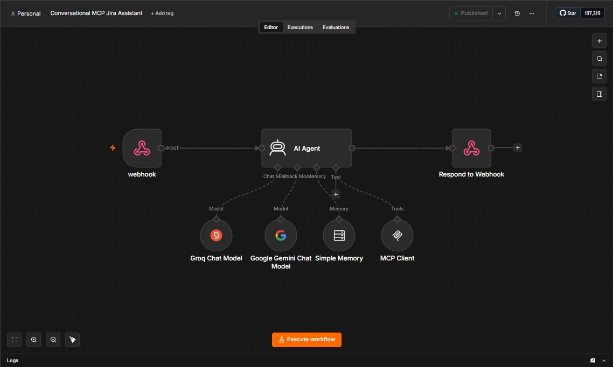
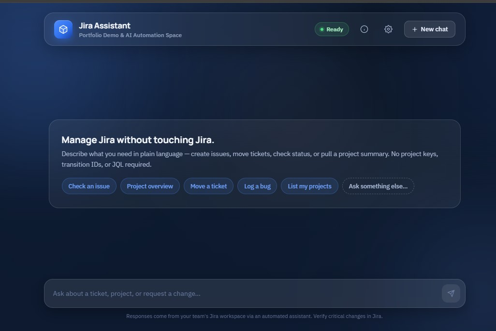
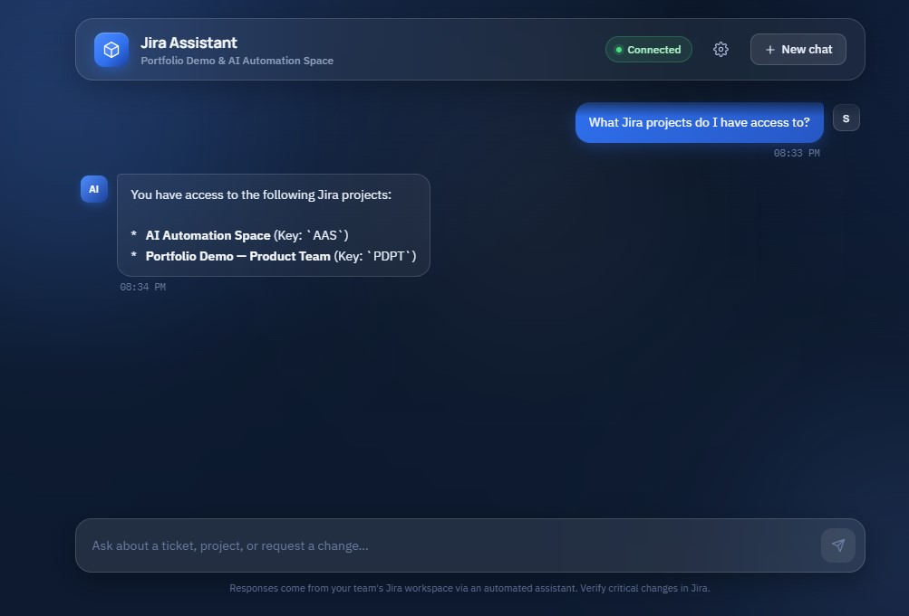
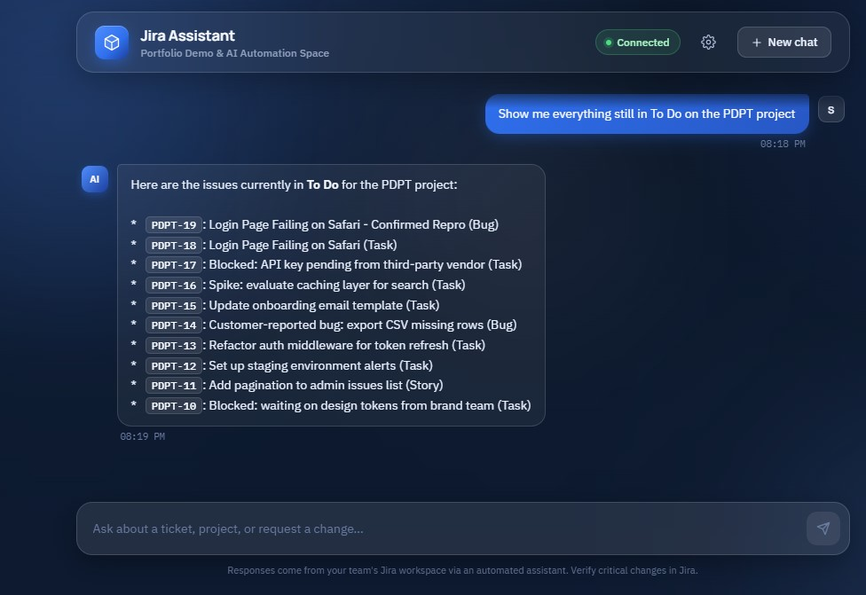
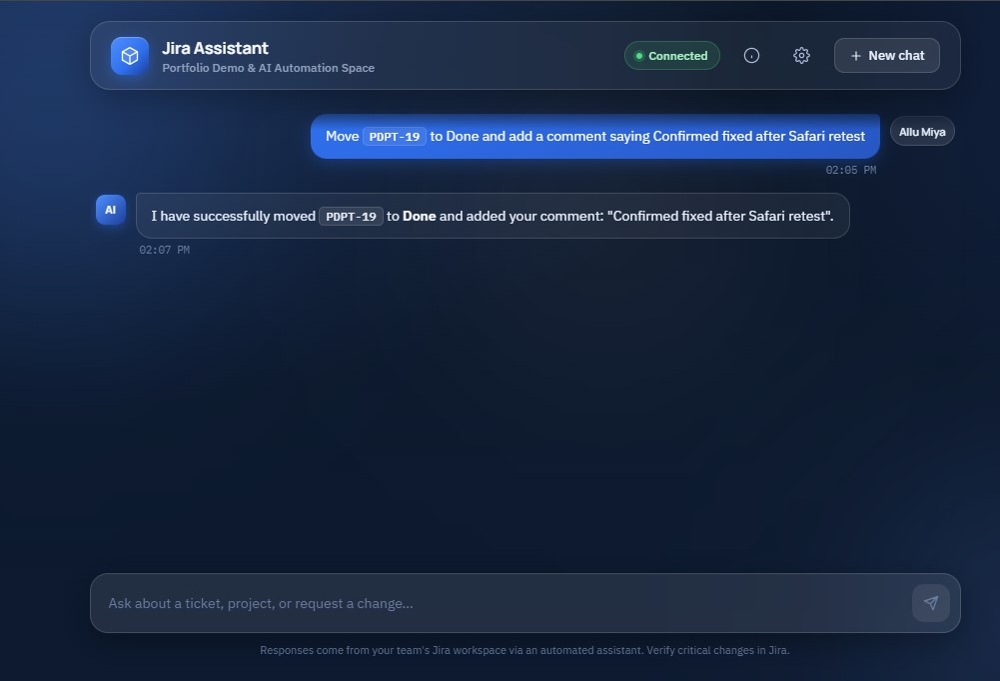
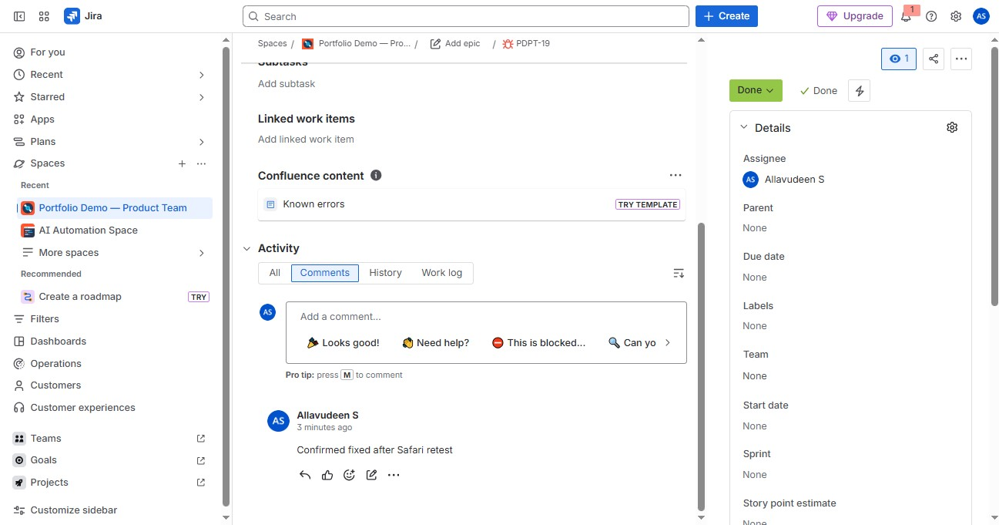
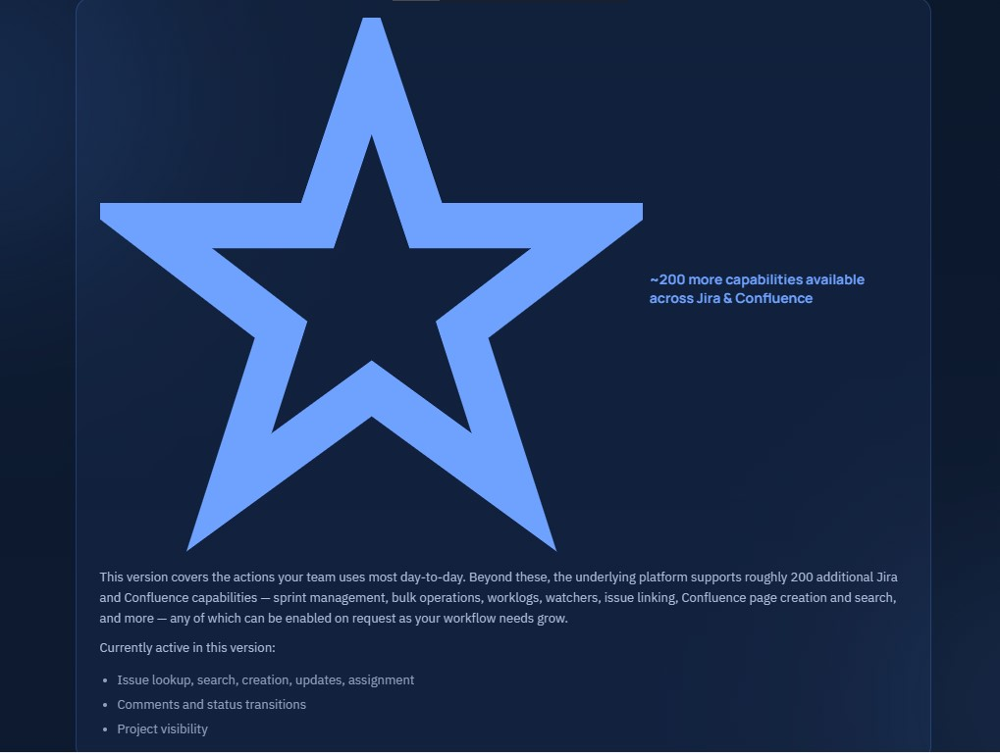
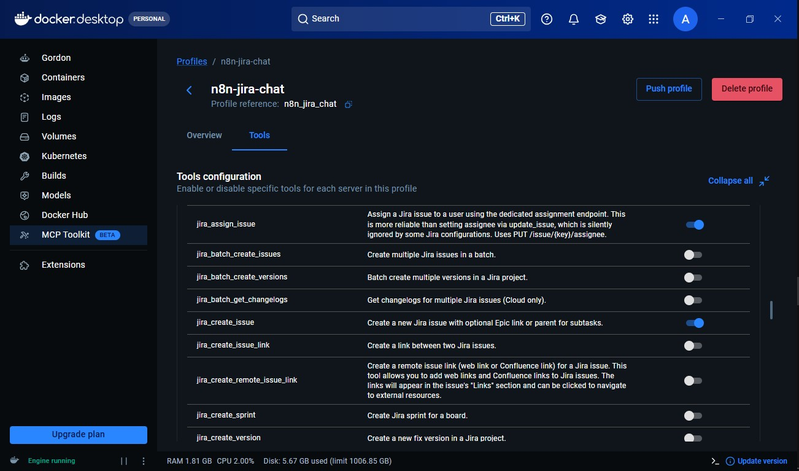

# n8n Automation #07 — Conversational MCP Jira Assistant

An n8n workflow that lets anyone manage Jira issues through plain English chat — no project keys, transition IDs, or JQL required. Built on MCP (Model Context Protocol) connecting directly to Jira via Docker's MCP Toolkit, with a multi-model LLM setup (Groq primary, Gemini fallback) behind a custom executive-facing chat interface.


---

## What it does

PMs, Project Heads, and VPs don't dislike Jira — they dislike the interface. Hunting for the right transition, remembering project keys, formatting a ticket properly. This workflow removes that friction entirely.

1. **Receives** a plain-English message via webhook from the chat interface.
2. **Interprets intent** — an AI Agent, governed by a 15-rule system prompt, decides which Jira action (or sequence of actions) the request requires.
3. **Calls Jira through MCP** — a Docker-hosted MCP server (sooperset/mcp-atlassian) exposes 9 selected tools; the agent calls only what it needs, in the right order.
4. **Fails over on rate limits** — Groq (primary) and Google Gemini (fallback) sit on independent token quotas, so a Groq TPD ceiling doesn't take the assistant down.
5. **Responds** via a JSON-safe webhook reply, rendered in a custom navy/glass chat UI with issue-key styling and markdown support.

## Architecture



```
Webhook (POST /jira-chat)
   └─▶ AI Agent (Tools Agent)
         ├─ Model:          Groq Chat Model (llama-3.3-70b-versatile)
         ├─ Fallback Model: Google Gemini Chat Model
         ├─ Memory:         Simple Memory (per-session buffer)
         └─ Tools:          MCP Client → sooperset/mcp-atlassian (9 selected tools)
                                            │
                                            ▼
                              Docker MCP Toolkit (SSE, Bearer Auth)
                                            │
                                            ▼
                                       Jira Cloud API
   └─▶ Respond to Webhook (JSON.stringify, Expression mode)
```

The **Respond to Webhook** node's body is a full expression — `{{ JSON.stringify({ reply: $json.output }) }}` — rather than a string with an embedded mustache. Multi-line, markdown-heavy replies (bulleted issue lists, etc.) contain raw newlines that break a hand-written JSON literal; letting n8n serialize the object properly escapes them automatically.

## Sample input

```json
POST /webhook/jira-chat
{
  "message": "Move PDPT-19 to Done and add a comment saying Confirmed fixed after Safari retest",
  "sessionId": "exec-a1b2c3-x9y8z7",
  "executionMode": "production"
}
```

This single request triggers a 3-call chain — `jira_get_transitions` → `jira_transition_issue` → `jira_add_comment` — and returns a plain-language confirmation once all three succeed.

## Available tools

| Tool | Description |
|---|---|
| `jira_get_all_projects` | List every project the user has access to |
| `jira_create_issue` | Create a new issue with structured summary/description/acceptance criteria |
| `jira_update_issue` | Edit fields on an existing issue |
| `jira_assign_issue` | Reassign an issue (exact email/username required) |
| `jira_add_comment` | Add a comment to an issue's activity log |
| `jira_get_transitions` | List valid status transitions for an issue |
| `jira_transition_issue` | Move an issue to a new status |
| `jira_get_issue` | Full issue details in one call (status, comments, transitions) |
| `jira_search` | Plain-language-driven search, translated to JQL by the agent |

Delete, sprint, bulk-create, worklog, watcher, and link tools are intentionally excluded from v1. The underlying platform supports roughly 200 more capabilities across Jira and Confluence, enabled on request as a team's workflow needs grow — not shipped by default.

## Screenshots









## Key technical decisions

- **`jira_transition_issue`'s comment field doesn't support ADF, despite the tool requiring Atlassian Document Format for any comment content.** Confirmed by bypassing the AI Agent entirely and firing the exact payload directly at the MCP Client node — a correctly-formatted, correctly-stringified ADF comment was still rejected, proving it was a genuine mcp-atlassian limitation, not a model formatting error. `jira_add_comment` converts plain text to ADF correctly; `jira_transition_issue` does not. Fix: never attach a comment inside a transition call — transition first, then call `jira_add_comment` as a separate follow-up.
- **Several tool parameters are required-but-ignorable**: `fields` on `jira_transition_issue`, and `expand`/`projects_filter`/`page_token` on `jira_search`/`jira_get_issue`, must be present as empty strings — omitting them entirely fails schema validation, but they don't need real values for most calls.
- **`additional_fields` must be a JSON-stringified string, not a raw object**, on both `jira_create_issue` and `jira_update_issue` — passing an actual object fails type validation even though it "looks" more correct.
- **A dynamic schema bug on `jira_create_issue`**: the Bug issue type requires a `components` field in its generated schema even though Components isn't a configured field on Bug at all in this Jira space. Workaround: a system-prompt retry rule — on that specific schema error, retry once with `components: []`.
- **Independent-provider fallback, not same-provider retry**: an earlier same-model fallback (Groq → Groq) doubled token draw against a single rate-limit pool and made TPM exhaustion worse, not better. Groq (primary) + Gemini (fallback) sit on genuinely separate quotas.
- **Honest-failure reporting had to be explicitly enforced.** After a transition failure, the agent initially reported success anyway despite the underlying tool call having failed. Fixed with an explicit rule: success may only be reported when the tool's own response confirms it, and a second consecutive failure must be reported plainly rather than retried indefinitely or guessed away.

## Tech stack

`n8n` · `MCP (Model Context Protocol)` · `sooperset/mcp-atlassian` · `Docker MCP Toolkit` · `Groq (llama-3.3-70b-versatile)` · `Google Gemini` · `Jira Cloud API` · HTML/CSS/JS (custom chat interface)

## Related automations

- [n8n #04 — AI-Powered Appointment Management Agent](#) — MCP client/server architecture, Google Calendar as source of truth
- [n8n #05 — AI-Enriched Payment Webhook Processor](#) — Groq enrichment, Airtable linked records
- [n8n #06 — Sprint Digest Automation](#) — Atlassian's official Remote MCP server, OAuth 2.1

---
*Part of a 30-automation portfolio exploring AI-augmented workflow automation for Agile/PM use cases. Built by Allavudeen — offshore TPM transitioning into AI Workflow Automation Consulting.*
